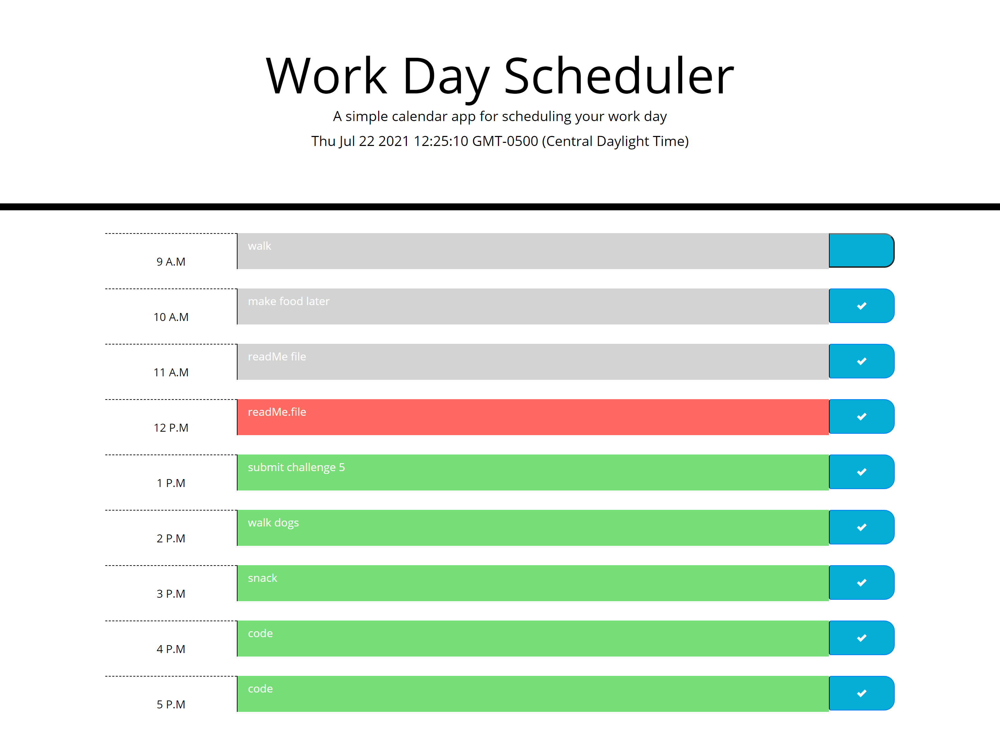

# work-day-scheduler

## Description
This application was creating using javascript to dynamically update HTML elements along with jQuery to help power CSS. Moment.js library was also used to handle the time and date functionally more efficiently. This application was created to help users keep track of the tasks they need to get done for that current day. The events can be saved in one hour time block from 9am-5pm. Each time block will display a different color depending if the event is in the past, present, or future according to the current time. The events can be edited anytime according to the user. Some future updates that I would love to do are storing the tasks in mulitple days and not just the current date. Send alerts to the user when an important task is approaching.

## Usage

Below is a screen shot of the application with some example tasks so the user can see how the calendar can be used.

